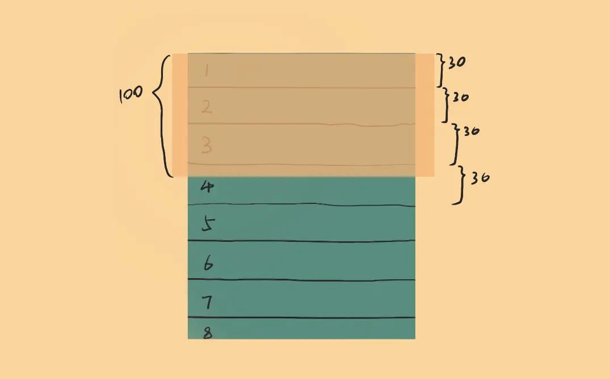
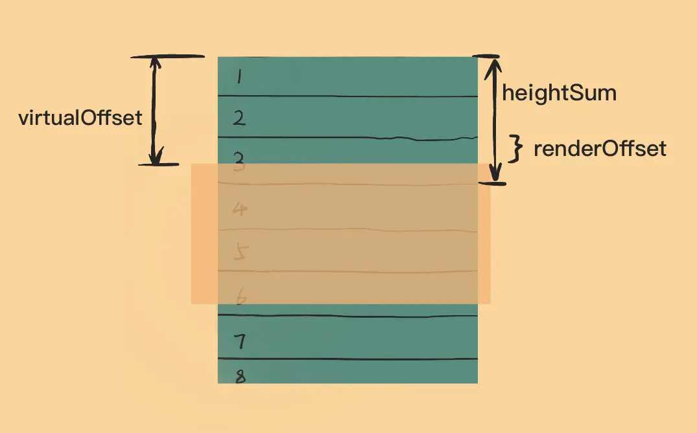

[掘金参考原文](https://juejin.cn/post/6844904183582162957)
## 虚拟滚动
### 真实滚动的痛点
浏览器渲染长列表，上万个节点，页面卡顿  
采用分页的方式？有些情况：联系人列表、聊天列表，还是需要滚动的交互方式  
### 基本思想
打开chrome开发者面板，performance查看渲染性能，**长列表渲染中耗时最长的是Rendeing(回流布局)**  
如何改善？**让浏览器只渲染看得见的DOM节点**
### 模拟滚动
只渲染可见的元素，就**意味着没有原生滚动的功能，需要去模拟滚动行为**，监听用户滚动或者滑动屏幕，根据滚动的位置重新渲染可见的列表元素，这并不是真正的滚动列表，只是视觉上的一种欺骗  
就像画帧动画，每一帧造成偏移量的改变
### 代码思路
1. 视口渲染几个列表元素？
视口的高度一般是父元素的高度，假设偏移量，先**给每个列表元素设置一个高度**  
假如每个元素30px，视口高度100px, 那么如果第一个元素顶到视口顶部，那么视口就是最多可见4个元素，30+30+30+10


2. 如果用户有滚动了，累计滚动了x像素后，那该从哪个元素开始渲染？


* 要记录用户操作的列表滚动总距离 **virtualOffset**,
* 从第一个元素累加高度得到 **heightSum**，图中 heightSum = 30 x 3 = 90px
* 最后一个累加的的元素，就是视口中可见的第一个元素，图中是元素3，并且它不是完整可见的
* 元素3向上偏移了一段距离，称其为 **renderOffset**，计算公式为：**renderOffset = virtualOffset - (heightSum - 元素3的高度)**

````js
class VirtualScroll{
    constructor({ el, list, itemElementGenerator, itemHeight}){
        this.viewport = el   // 视口元素
        this.list  = list // 需要展示的列表数据
        this.itemHeight = itemHeight // 每个列表元素的高度
        this.itemElementGenerator = itemElementGenerator // 列表元素的DOM生成器
        
        this._virtualOffset = 0
        this.virtualOffset = this._virtualOffset

        this.initContainer()
        this.mapList()
        this.bindEvents() // 绑定监听事件
    }

    set virtualOffset(val) {
        this._virtualOffset = val
        this.render(val)
    }
    
    get virtualOffset() {
        return this._virtualOffset
    }

    initContainer(){
        this.containerHeight = this.viewport.clientHeight
        this.viewport.style.overflow = 'hidden'
        this.contentHeight = sumHeight(this._list)
    }

    mapList(){
        this._list = this.list.map((item,i)=>{
            height: this.itemHeight,
            index: 1,
            item: item
        })
    }

    bindEvents(){
        let y = 0
        const scrollSpace = this.contentHeight - this.containerHeight
        const updateOffset = (e) => {
            e.preventDefault()
            y += e.deltaY
            y = Math.max(y, 0)
            y = Math.min(y, scrollSpace)
            this.virtualOffset = y
        }

        /* 
          监听视口的滚轮事件，该事件对象有一个属性叫做deltaY，记录的是滚轮滚动的方向以及滚动量
        */
        this.viewport.addEventListener("wheel", updateOffset)
    }

    render(virtualOffset){
        const headIndex = findIndexOverHeight(this._list,virtualOffset)
        const tailIndex = findIndexOverHeight(this._list,virtualOffset + this.containerHeight)

        this.renderOffset = offset - sumHeight(this._list,0,headIndex)
        this.renderList = this._list.slice(headIndex,tailIndex+1)

        const $listWp = document.createElement("div")
        this.renderList.forEach((item)=>{
            const $el = this.itemElementGenerator(item)
            $listWp.appendChild($el)
        })
        $listWp.style.transform = `translateY(-${this.renderOffset}px)`
        this.viewport.innerHTML = ''
        this.viewport.appendChild($listWp)
    }
}

// 找到一个累加高度大于指定高度的序号
function findIndexOverHeight(list,offset){
    let currentHeight = 0
    for(let i=0;i< list.length;i++){
        const { height } = list[i]
        currentHeight += height
        if(currentHeight > offset){
            return i
        }
    }
    return list.length - 1
}

// 获取列表中某一段的累加高度
function sumHeight(list,start=0,end = list.length){
    let height = 0
    for(let i = start; i<end;i++){
        height += list[i].height
    }
    return height
}
````
### 虚拟滚动和无限滚动（懒加载）的区别
* 虚拟滚动：只渲染可视部分，不可见部分不渲染，一次性拿到全部数据, 列表10个固定列表项DOM节点，就一直是10个
* 无限滚动：每次只渲染一部分，等到滚动底部，再渲染一部分，所以可以分阶段去请求数据

虚拟滚动最大的弊端，每次滑到底部，才加载一部分，体验不太好

### 懒加载利用IntersectionObserver API实现
````js
const imgs = document.querySelectorAll('img')
var options = {}
function lazyLoad(target){
    const observer = new IntersectionObserver((entries,observer)=>{
        entries.forEach(entrie =>{
            if(entrie.isIntersecting){
                const img = entrie.target
                const src = img.getArribute('data-src')
                img.setAttribute('src',src)
                observer.unobserve(img) // 停止监听已经加载完成的图片
            }
        })
    }，options)
    observer.observe(target)
}
imgs.forEach(lazyload)
````
